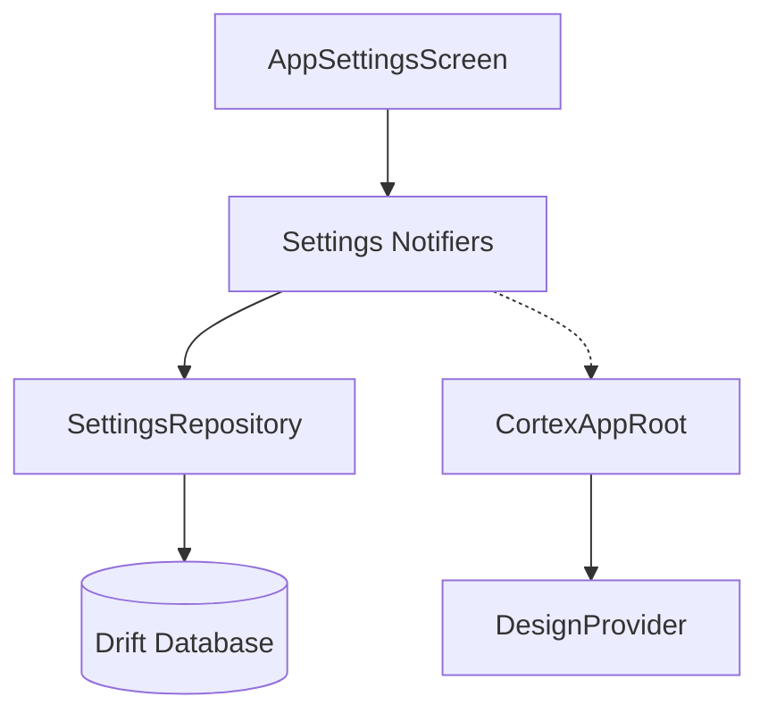

## Context

The current user profile experience allows users to view their learning progress but lacks the ability for them to modify their own data or customize the behavior of the application. To move toward a feature-complete LMS, we need to implement the interfaces for account management and application preferences that were defined in the initial design phase.

## Goals / Non-Goals

**Goals:**
- Implement a reactive **App Settings** interface that controls global application behavior (theme, video quality, etc.).
- Implement an **Edit Profile** form for updating user-specific identity information.
- Ensure all user preferences persist across application restarts.

**Non-Goals:**
- Implementing server-side API integration (handled by a separate data layer change).
- Password reset or account deletion flows (out of scope for this phase).
- Social login link/unlink management.

# DESIGN: LMS App Settings

## Technical Decisions

### 1. Preference Persistence
- **Implementation**: `SettingsRepository` in `packages/data`.
- **Storage**: Drift (SQLite) using a singleton table pattern (`AppSettingsTable`).
- **Rationale**: A single-row table provides type-safety for each setting while ensuring atomicity when multiple preferences are updated.

### 2. State Management
- **Framework**: Riverpod.
- **Pattern**: `AsyncNotifier` for global settings (Appearance, Playback, Accessibility).
- **Consolidation**: The existing `designModeProvider` will be refactored to proxy the persistent `appearanceSettingsNotifierProvider`.

### 3. Display Integration
- **Mechanism**: `DesignProvider` in `packages/core`.
- **Logic**: Watches `designModeProvider` to switch `DesignConfig` at the app root.

## Architecture Diagram

## Risks & Trade-offs
| Risk | Mitigation |
| :--- | :--- |
| **Race conditions** | Use Drift's `insertOnConflictUpdate` and atomic writes for settings. |
| **Initialization delay** | Provide immediate UI defaults (system theme) while the database row is loading. |
| **Complexity** | Keep settings decoupled from feature business logic; features only "read" the state. |
| **Inconsistent UX (mid-playback)** | The settings will update the global preference provider, but active players will decide how to apply the change (e.g., waiting for the next segment to avoid buffering). |
